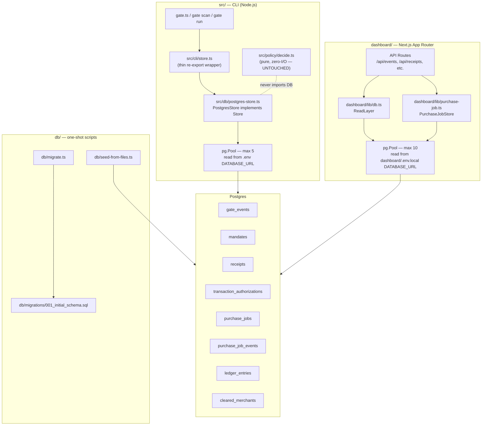
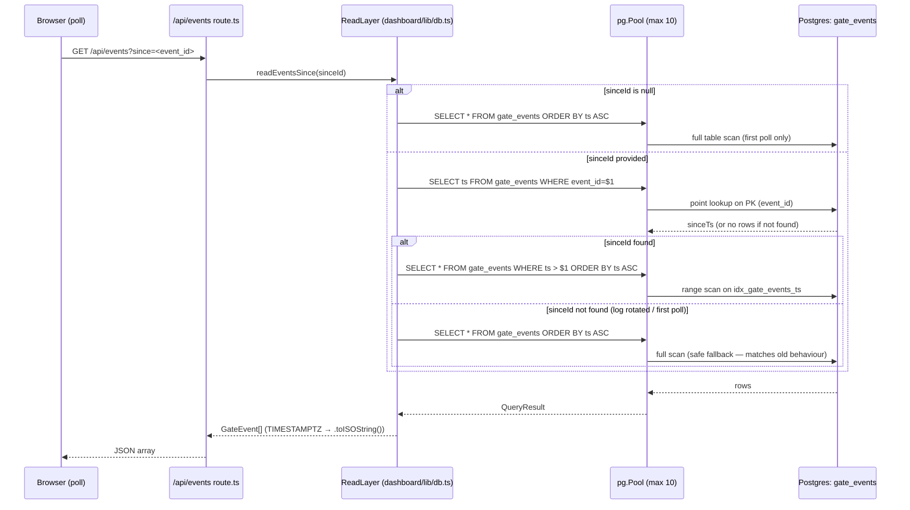

# Design Document: Database Migration

## Overview

This document describes the technical architecture for migrating Mandate Gate's persistence layer
from flat files to Postgres. The migration is strictly a data-layer swap — `decide()`, all
TypeScript domain interfaces (`GateEvent`, `Mandate`, `Receipt`, `TransactionAuthorization`), and
all caller signatures at the CLI and dashboard boundary remain completely unchanged.

### Key constraints (from `docs/07-SCALING-PATH.md`)

- **No ORM.** Raw SQL with parameterized queries only, matching the project's zero-unnecessary-
  dependency philosophy. The `pg` (node-postgres) package is the sole addition.
- **Two independent pools.** `src/` (CLI) uses a pool of max 5; `dashboard/` uses a pool of max 10.
  Both read `DATABASE_URL` from their respective env files but are completely independent `Pool`
  instances.
- **`decide()` is untouched.** It remains a pure, synchronous, zero-I/O function. No database
  module may ever be imported from `src/policy/`.
- **Domain interfaces are untouched.** `GateEvent`, `Mandate`, `Receipt`, and
  `TransactionAuthorization` shapes do not change. The DB columns mirror them exactly.

### What changes

| Concern | Before | After |
|---|---|---|
| Mandates/Receipts/Authorizations | `mandates/*.json`, `receipts/*.json`, `authorizations/*.json` | `mandates`, `receipts`, `transaction_authorizations` Postgres tables |
| Event log | Append-only `events.jsonl` | `gate_events` table indexed on `(mandate_id, ts)` and `ts` |
| Purchase jobs | `purchase_jobs_store.json` + in-memory Map | `purchase_jobs` + `purchase_job_events` tables |
| Ledger audit | `ledger.jsonl` | `ledger_entries` table with idempotency key |
| Store write path | `src/cli/store.ts` with `fs` calls | `Store` interface + `PostgresStore` implementation; `store.ts` becomes a re-export |
| Dashboard read path | `dashboard/lib/read.ts` with `readdirSync` / `readFileSync` | `ReadLayer` class in `dashboard/lib/db.ts` querying Postgres |

### What does not change

- `decide()` in `src/policy/decide.ts`
- All TypeScript interfaces in `src/events/GateEvent.ts`, `src/mandate/schema.ts`, `src/receipt/schema.ts`, `src/receipt/authorization.ts`
- Exported function signatures of `src/cli/store.ts` (callers are zero-change)
- PEM key files — `keys/` stays on disk, out of scope

---

## Architecture

### High-level component diagram



### Two-pool design rationale

The CLI (`src/`) and dashboard (`dashboard/`) are separate Node.js processes with independent
module graphs. They cannot share a `Pool` instance at runtime. Both read from the same
`DATABASE_URL` value (pointing at the same Postgres database), but each process creates its own
pool with limits tuned for its workload:

- **CLI pool (max 5):** The CLI is single-user, invoked as short-lived command processes. Five
  connections are more than enough headroom and won't exhaust a standard Postgres `max_connections`.
- **Dashboard pool (max 10):** Next.js API routes are short-lived but can be hit concurrently by
  multiple browser tabs or polling loops. Ten connections give headroom without over-provisioning.

Neither pool is shared across the process boundary — each is created at module load time (lazily
on first use for the CLI) and torn down via `pool.end()` on process exit.

---

## Components and Interfaces

### 1. `src/db/store.interface.ts` — Store interface

```typescript
import type { GateEvent } from '../events/GateEvent';
import type { Mandate } from '../mandate/schema';
import type { Receipt } from '../receipt/schema';
import type { TransactionAuthorization } from '../receipt/authorization';

export interface Store {
  appendEvent(event: GateEvent): Promise<void>;
  saveMandate(mandate: Mandate): Promise<void>;
  loadMandate(mandateId: string): Promise<Mandate>;
  loadAllMandates(): Promise<Mandate[]>;
  saveReceipt(receipt: Receipt): Promise<void>;
  loadReceipt(receiptId: string): Promise<Receipt>;
  loadAllReceipts(): Promise<Receipt[]>;
  saveAuthorization(auth: TransactionAuthorization): Promise<void>;
  loadAuthorization(authorizationId: string): Promise<TransactionAuthorization>;
  loadAllAuthorizations(): Promise<TransactionAuthorization[]>;
}
```

All methods are `async` — the flat-file implementations were synchronous, but the interface is
forward-compatible for any callers that already `await` or for any new async context.

### 2. `src/db/postgres-store.ts` — PostgresStore

Implements `Store` with raw parameterized SQL against the schema in Requirement 1. Key design
decisions:

- **Upsert on `saveMandate`:** `INSERT ... ON CONFLICT (mandate_id) DO UPDATE SET ...` — supports
  `gate mandate resign` which creates a new mandate file today; after migration, re-running with
  the same `mandate_id` overwrites cleanly.
- **Error message parity:** `loadMandate`, `loadReceipt`, `loadAuthorization` throw errors with
  the exact same message format as the existing flat-file implementation so no calling code has to
  change its error handling.
- **JSONB columns:** `scope` and `reserve` on `mandates`; `cart`, `payment`, `execution`,
  `evidence` on `receipts`; `cart` on `transaction_authorizations`. Scalar fields are individual
  typed columns. The `pg` driver returns JSONB columns already parsed as JS objects — no `JSON.parse()`
  needed at read time.
- **Ordering:** `loadAllMandates` → `ORDER BY mandate_id DESC` (latest ULID first, mirrors the
  existing string-sort behaviour). `loadAllReceipts` → `ORDER BY signed_at ASC` (chain order).

### 3. `src/cli/store.ts` — thin re-export wrapper

The existing file is replaced with a module that:
1. Creates and exports a singleton `PostgresStore` instance.
2. Re-exports all function names (e.g. `appendEvent`, `saveMandate`) by delegating to the
   singleton — keeping the existing call-site signature `appendEvent(event)` unchanged.
3. Registers a `process.on('exit')` / signal handler to call `pool.end()`.

```typescript
// src/cli/store.ts (after migration)
import { PostgresStore } from '../db/postgres-store';
export const store = new PostgresStore();

// Re-exports — zero caller changes required
export const appendEvent  = (event: GateEvent)                      => store.appendEvent(event);
export const saveMandate  = (mandate: Mandate)                      => store.saveMandate(mandate);
export const loadMandate  = (id: string)                            => store.loadMandate(id);
// ... etc.
```

### 4. `dashboard/lib/db.ts` — ReadLayer

Replaces the file-scan functions in `dashboard/lib/read.ts` with indexed Postgres queries.
The existing `read.ts` file is updated to delegate to `ReadLayer` (or replaced entirely —
implementation detail). All exported function signatures remain unchanged so API route callers
require zero changes.

Key query patterns:

| Function | Query |
|---|---|
| `readEventsSince(sinceId)` | `SELECT * FROM gate_events WHERE ts > (SELECT ts FROM gate_events WHERE event_id = $1) ORDER BY ts ASC` — falls back to `SELECT * FROM gate_events ORDER BY ts ASC` when sinceId is null or not found |
| `readCurrentMandate()` | `SELECT * FROM mandates ORDER BY mandate_id DESC LIMIT 1` |
| `readReceipts()` | `SELECT * FROM receipts ORDER BY signed_at ASC` |
| `readAuthorizations()` | `SELECT * FROM transaction_authorizations ORDER BY authorized_at ASC` |

The `ReadLayer` also handles JSONB deserialization — Postgres JSONB columns come back as
parsed objects via the `pg` driver, so the TypeScript interface is reconstructed by spreading
scalar columns and nested JSONB values together.

### 5. `dashboard/lib/purchase-job.ts` — PurchaseJobStore (rewritten)

Replaces the in-memory `Map`, `MAX_JOBS` eviction, and `persistJobsToDisk`/`loadJobsFromDisk`
functions with Postgres operations:

- **`startPurchaseJob`:** Inserts a `purchase_jobs` row with `status='running'` synchronously
  before `runAgentBuy` is called. The in-memory `jobs` Map is removed.
- **`onLine` callback:** Each `AgentLine` fires two queries atomically:
  1. `INSERT INTO purchase_job_events (job_id, seq, event) VALUES ($1, $2, $3)` with
     `seq` derived from `SELECT COALESCE(MAX(seq), 0) + 1 FROM purchase_job_events WHERE job_id = $1`
     inside a transaction (serialized to prevent gaps under concurrency).
  2. `UPDATE purchase_jobs SET state = $2 WHERE id = $1`.
- **`getPurchaseJob`:** Joins `purchase_jobs` with an ordered `purchase_job_events` query.
- **`hasBeenCleared` / `markCleared`:** Use `cleared_merchants(session_id, merchant)` table instead
  of the in-memory `clearedMerchants` Map.

### 6. `DodoCreditLedger` — ledger audit integration

`draw()` and `credit()` each fire an additional `INSERT INTO ledger_entries ...` after the Dodo
API call succeeds. The insert uses `ON CONFLICT (idempotency_key) DO NOTHING` — if the Dodo call
was already idempotent, the audit row is too. A failed insert is logged but never rethrows —
the Dodo-hosted ledger is authoritative.

### 7. `db/migrate.ts` — migration runner

Reads `DATABASE_URL` from environment (throws explicitly if absent), connects, then applies each
`.sql` file in `db/migrations/` in lexicographic order. Uses `CREATE TABLE IF NOT EXISTS` and
`CREATE INDEX IF NOT EXISTS` for idempotency. No migration state table is needed for the single
initial migration.

### 8. `db/seed-from-files.ts` — data migration script

One-shot script (safe to re-run). Reads existing flat files, inserts into Postgres with
`ON CONFLICT DO NOTHING` on primary keys. Does not delete or modify source files. Prints a
per-table summary of records inserted vs skipped.

---

## Data Models

### `gate_events`

Maps 1:1 to `GateEvent`. All scalar fields are individual typed columns. No JSONB needed — every
field on `GateEvent` is a primitive.

```sql
CREATE TABLE IF NOT EXISTS gate_events (
  event_id      TEXT PRIMARY KEY,
  ts            TIMESTAMPTZ NOT NULL,
  mandate_id    TEXT NOT NULL,
  mandate_hash  TEXT NOT NULL,
  command       TEXT NOT NULL,
  access        TEXT NOT NULL CHECK (access IN ('read', 'write')),
  verdict       TEXT NOT NULL CHECK (verdict IN ('ALLOW', 'DENY', 'STEP_UP')),
  code          TEXT,
  amount_inr    NUMERIC,
  run_id        TEXT,
  reserve_ref   TEXT,
  trace_digest  TEXT
);
CREATE INDEX IF NOT EXISTS idx_gate_events_mandate_ts ON gate_events (mandate_id, ts);
CREATE INDEX IF NOT EXISTS idx_gate_events_ts         ON gate_events (ts);
```

### `mandates`

Top-level scalars as columns; `scope` and `reserve` as JSONB (they are objects with no
queryable sub-fields needed for the current feature set — a future filter on `scope.merchants`
can use `scope->>'merchants'` without a schema change).

```sql
CREATE TABLE IF NOT EXISTS mandates (
  mandate_id  TEXT PRIMARY KEY,
  issuer      TEXT NOT NULL,
  subject     TEXT NOT NULL,
  scope       JSONB NOT NULL,
  reserve     JSONB NOT NULL,
  sig         TEXT NOT NULL,
  created_at  TIMESTAMPTZ NOT NULL DEFAULT now()
);
```

### `receipts`

```sql
CREATE TABLE IF NOT EXISTS receipts (
  receipt_id         TEXT PRIMARY KEY,
  authorization_id   TEXT NOT NULL REFERENCES transaction_authorizations(authorization_id),
  mandate_hash       TEXT NOT NULL,
  cart               JSONB NOT NULL,
  payment            JSONB NOT NULL,
  execution          JSONB NOT NULL,
  evidence           JSONB NOT NULL,
  prev_receipt_hash  TEXT NOT NULL,
  signed_at          TIMESTAMPTZ NOT NULL,
  sig                TEXT NOT NULL
);
CREATE INDEX IF NOT EXISTS idx_receipts_mandate_hash ON receipts (mandate_hash);
```

Note: `receipts` references `transaction_authorizations` via FK — the authorization must be
inserted before the receipt. The existing CLI flow already does this (authorization is created
at `decide()` ALLOW, receipt is created after merchant confirmation), so the FK constraint
simply enforces what was already invariant.

### `transaction_authorizations`

```sql
CREATE TABLE IF NOT EXISTS transaction_authorizations (
  authorization_id      TEXT PRIMARY KEY,
  run_id                TEXT NOT NULL,
  mandate_id            TEXT NOT NULL,
  mandate_hash          TEXT NOT NULL,
  merchant              TEXT NOT NULL,
  cart                  JSONB NOT NULL,
  verdict               TEXT NOT NULL CHECK (verdict = 'ALLOW'),
  reserve_verified_inr  NUMERIC NOT NULL,
  authorized_at         TIMESTAMPTZ NOT NULL,
  sig                   TEXT NOT NULL
);
CREATE INDEX IF NOT EXISTS idx_tx_auth_mandate_id ON transaction_authorizations (mandate_id);
```

### `purchase_jobs` + `purchase_job_events`

```sql
CREATE TABLE IF NOT EXISTS purchase_jobs (
  id           TEXT PRIMARY KEY,
  session_id   TEXT NOT NULL,
  status       TEXT NOT NULL CHECK (status IN ('running', 'done', 'failed')),
  state        TEXT NOT NULL,
  input        JSONB NOT NULL,
  started_at   TIMESTAMPTZ NOT NULL,
  finished_at  TIMESTAMPTZ
);
CREATE INDEX IF NOT EXISTS idx_purchase_jobs_session ON purchase_jobs (session_id);

CREATE TABLE IF NOT EXISTS purchase_job_events (
  id           BIGSERIAL PRIMARY KEY,
  job_id       TEXT NOT NULL REFERENCES purchase_jobs(id),
  seq          INTEGER NOT NULL,
  event        JSONB NOT NULL,
  recorded_at  TIMESTAMPTZ NOT NULL DEFAULT now(),
  UNIQUE (job_id, seq)
);
CREATE INDEX IF NOT EXISTS idx_pje_job_seq ON purchase_job_events (job_id, seq);
```

The `UNIQUE (job_id, seq)` constraint is the database-level enforcement of gapless, unique seq
values under concurrent writes. The application layer uses a serialized transaction to compute
the next seq atomically.

### `ledger_entries`

```sql
CREATE TABLE IF NOT EXISTS ledger_entries (
  id               BIGSERIAL PRIMARY KEY,
  reserve_ref      TEXT NOT NULL,
  entry_type       TEXT NOT NULL CHECK (entry_type IN ('debit', 'credit')),
  amount_inr_paise BIGINT NOT NULL,
  idempotency_key  TEXT NOT NULL UNIQUE,
  mandate_id       TEXT,
  run_id           TEXT,
  recorded_at      TIMESTAMPTZ NOT NULL DEFAULT now()
);
CREATE INDEX IF NOT EXISTS idx_ledger_reserve ON ledger_entries (reserve_ref);
```

### `cleared_merchants`

Replaces the in-memory `clearedMerchants` Map in `purchase-job.ts`.

```sql
CREATE TABLE IF NOT EXISTS cleared_merchants (
  session_id  TEXT NOT NULL,
  merchant    TEXT NOT NULL,
  PRIMARY KEY (session_id, merchant)
);
```

### TypeScript → Column mapping summary

| Interface field | Column type | Notes |
|---|---|---|
| `GateEvent.ts` (string ISO 8601) | `TIMESTAMPTZ` | pg driver parses to `Date`; serialize with `.toISOString()` on read-back |
| `Mandate.scope` (nested object) | `JSONB` | pg driver returns parsed JS object |
| `Mandate.reserve` (nested object) | `JSONB` | pg driver returns parsed JS object |
| `Receipt.cart / payment / execution / evidence` | `JSONB` | pg driver returns parsed JS objects |
| `TransactionAuthorization.cart` | `JSONB` | pg driver returns parsed JS object |
| `Receipt.signed_at` (string ISO 8601) | `TIMESTAMPTZ` | same ISO round-trip as `GateEvent.ts` |
| `TransactionAuthorization.authorized_at` | `TIMESTAMPTZ` | same ISO round-trip |
| All `*_id` fields | `TEXT` | ULID/UUID strings, no conversion needed |
| `amount_inr` (number) | `NUMERIC` | `pg` returns NUMERIC as string by default — must call `parseFloat()` on read-back |
| `ledger_entries.amount_inr_paise` | `BIGINT` | `pg` returns BIGINT as string — must call `parseInt()` on read-back |

**NUMERIC/BIGINT read-back caveat:** The `pg` driver returns `NUMERIC` and `BIGINT` columns as
JavaScript strings to avoid precision loss. Both `PostgresStore` and `ReadLayer` must explicitly
coerce these with `parseFloat()` / `parseInt()` when reconstructing TypeScript interface values,
matching the same coercion pattern already used in `DodoCreditLedger.balance()`.

---

## Sequence Diagrams

### addEvent flow (CLI → PostgresStore → gate_events)

```mermaid
sequenceDiagram
    participant CLI as gate.ts (CLI)
    participant StoreTS as src/cli/store.ts
    participant PGStore as PostgresStore
    participant Pool as pg.Pool (max 5)
    participant DB as Postgres: gate_events

    CLI->>StoreTS: appendEvent(event: GateEvent)
    StoreTS->>PGStore: appendEvent(event)
    PGStore->>Pool: pool.query(INSERT INTO gate_events ..., [params])
    Note over PGStore,Pool: Parameterized — event_id, ts, mandate_id,\nmandate_hash, command, access, verdict,\ncode?, amount_inr?, run_id?, reserve_ref?,\ntrace_digest? all as $N placeholders
    Pool->>DB: INSERT
    DB-->>Pool: OK (rowCount=1)
    Pool-->>PGStore: QueryResult
    PGStore-->>StoreTS: void (resolved)
    StoreTS-->>CLI: void (resolved)
    Note over CLI: Terminal line already printed;\nDB write is fire-and-await (not fire-and-forget)\nbefore the CLI process exits
```

### purchase job state update flow (AgentLine → purchase_job_events + purchase_jobs)

```mermaid
sequenceDiagram
    participant Agent as runAgentBuy callback
    participant PJStore as PurchaseJobStore
    participant Pool as pg.Pool (max 10)
    participant DB as Postgres

    Agent->>PJStore: onLine(agentLine: AgentLine)
    PJStore->>Pool: BEGIN
    Pool->>DB: BEGIN
    PJStore->>Pool: SELECT COALESCE(MAX(seq),0)+1 FROM purchase_job_events WHERE job_id=$1
    Pool->>DB: SELECT (locked for update)
    DB-->>Pool: nextSeq
    PJStore->>Pool: INSERT INTO purchase_job_events (job_id, seq, event) VALUES ($1,$2,$3)
    Pool->>DB: INSERT
    DB-->>Pool: OK (UNIQUE constraint enforces no dup seq)
    PJStore->>Pool: COMMIT
    Pool->>DB: COMMIT
    PJStore->>Pool: UPDATE purchase_jobs SET state=$2 WHERE id=$1
    Pool->>DB: UPDATE (outside transaction — state update is best-effort)
    DB-->>Pool: OK
    Pool-->>PJStore: void
    PJStore-->>Agent: void
    Note over PJStore: If INSERT fails (e.g. unique violation on seq),\ntransaction is rolled back.\nError is logged; agent run continues (req 5.10)
```

### dashboard readEventsSince flow (polling route → ReadLayer → gate_events)



---

## Correctness Properties

*A property is a characteristic or behavior that should hold true across all valid executions of a
system — essentially, a formal statement about what the system should do. Properties serve as the
bridge between human-readable specifications and machine-verifiable correctness guarantees.*

The domain logic being tested here is the Store/ReadLayer data transformation code — the functions
that serialize TypeScript interface values to SQL parameters and reconstruct them from `pg`
`QueryResult` rows. This is pure input-output transformation code where property-based testing
excels: the input space (any valid `Mandate`, any set of events, any `seq` arrival order) is large
and edge cases (NUMERIC string coercion, TIMESTAMPTZ round-trip, JSONB nested field reconstruction)
are exactly what random generators surface.

PBT is appropriate here because:
- All transformation functions (`serializeMandate`, `rowToMandate`, etc.) are pure with clear
  input/output behavior — no I/O except the DB call, which is mocked in unit tests.
- Universal ordering and filtering properties hold across the full input space.
- `seq` uniqueness under concurrency is precisely the kind of invariant where 100 iterations with
  random arrival orders find races that 2–3 hand-written examples miss.

### Property 1: Domain object round-trip

*For any* valid domain object (`GateEvent`, `Mandate`, `Receipt`, or `TransactionAuthorization`),
serializing it to the corresponding Postgres table via `PostgresStore` and reading it back with the
matching `load*` function should return a value that is deeply equal to the original — including
all nested sub-objects, all optional fields (whether present or absent), and all numeric values
(with correct `parseFloat`/`parseInt` coercion of NUMERIC/BIGINT columns).

**Validates: Requirements 3.2, 3.3 (partial), 4.5, 8.3, 8.4, 8.5, 8.6**

### Property 2: Upsert overwrites on conflict

*For any* mandate and *any* updated version of that mandate sharing the same `mandate_id`, calling
`saveMandate` twice (first with the original, then with the update) should result in `loadMandate`
returning the updated version — not the original, not a merge, exactly the second write.

**Validates: Requirements 3.3**

### Property 3: Ordered retrieval invariants

*For any* non-empty set of mandates inserted in any order, `loadAllMandates()` shall return them
with the mandate whose `mandate_id` is lexicographically greatest appearing first (DESC ULID order).
Equivalently, `readCurrentMandate()` shall return exactly that same greatest-`mandate_id` mandate.

**Validates: Requirements 3.5, 4.2**

### Property 4: Chronological ordering for receipts and authorizations

*For any* set of receipts with varying `signed_at` timestamps inserted in any order,
`loadAllReceipts()` and `readReceipts()` shall return them ordered by `signed_at` ascending.
Equivalently, *for any* set of `TransactionAuthorization` records with varying `authorized_at`
values, `readAuthorizations()` shall return them ordered by `authorized_at` ascending.

**Validates: Requirements 3.7, 4.3, 4.4**

### Property 5: readEventsSince returns the correct subset

*For any* non-empty set of `GateEvent` records in the database and *any* `sinceId` value, the
result of `readEventsSince(sinceId)` shall contain exactly the events whose `ts` is strictly
greater than the `ts` of the event with `event_id = sinceId`. When `sinceId` is null, or when
no event matches `sinceId`, all events shall be returned. No event from the correct subset shall
be missing; no event from outside the subset shall be included.

**Validates: Requirements 4.1**

### Property 6: purchase_job_events seq is unique and gapless under concurrency

*For any* purchase job receiving N `AgentLine` events, even when those events arrive concurrently
from multiple async callbacks, the resulting `purchase_job_events` rows for that job shall have
`seq` values that form the exact set `{1, 2, 3, ..., N}` — no duplicates, no gaps, no values
outside that range. The `UNIQUE (job_id, seq)` constraint enforces this at the DB level; the
application-level serialized transaction enforces it against concurrent writers.

**Validates: Requirements 5.3, 5.9**

### Property 7: getPurchaseJob reconstructs full job including ordered events

*For any* purchase job with N events stored in `purchase_job_events`, calling `getPurchaseJob(id)`
shall return a `PurchaseJob` object whose `events[]` array has exactly N elements, in ascending
`seq` order, with each element deeply equal to the JSONB value stored at that `seq` position.

**Validates: Requirements 5.5**

### Property 8: getJobsBySession returns exactly matching jobs

*For any* non-empty set of purchase jobs distributed across multiple `sessionId` values, calling
`getJobsBySession(sessionId)` shall return exactly the jobs whose `session_id` column equals
`sessionId` — no jobs from other sessions, no jobs from the queried session missing.

**Validates: Requirements 5.6**

### Property 9: hasBeenCleared / markCleared round-trip

*For any* `(sessionId, merchant)` pair, calling `markCleared(sessionId, merchant)` and then
`hasBeenCleared(sessionId, merchant)` shall return `true`. For *any* `(sessionId, merchant)` pair
that has not been marked cleared, `hasBeenCleared` shall return `false`. The two results must be
consistent across process restarts (data lives in `cleared_merchants` table, not in-memory).

**Validates: Requirements 5.8**

### Property 10: Ledger audit round-trip for both entry types

*For any* `(reserveRef, amountInrPaise, idempotencyKey)` triple, after `draw()` is called (adding
a debit row) or `credit()` is called (adding a credit row), `getLedgerEntriesByReserve(reserveRef)`
shall include a row with the matching `entry_type`, `amount_inr_paise`, and `idempotency_key`.
The returned entries shall be ordered by `recorded_at` ascending.

**Validates: Requirements 6.1, 6.2, 6.5**

### Property 11: idempotency_key conflict is a no-op

*For any* `idempotency_key`, inserting a ledger entry row twice (same key, any content on the
second call) shall result in exactly one row in `ledger_entries` with that `idempotency_key` — the
first insertion. No error shall be raised; the second call silently resolves.

**Validates: Requirements 6.3**

### Property 12: getTotalDrawnForReserve equals sum of debit entries

*For any* `reserveRef` and *any* list of `amount_inr_paise` values written as debit entries for
that reserve, `getTotalDrawnForReserve(reserveRef)` shall return a value equal to the arithmetic
sum of those amounts. Credit entries for the same reserve shall not affect the result.

**Validates: Requirements 6.6**

---

## Error Handling

### `DATABASE_URL` not set

Both `src/db/postgres-store.ts` and `dashboard/lib/db.ts` check for `DATABASE_URL` at module
load time (or at first `Pool` construction) and throw a descriptive error immediately:

```
Error: DATABASE_URL is not set — required for PostgresStore. Add it to .env (CLI) or dashboard/.env.local (dashboard).
```

This matches the pattern already used in `DodoCreditLedger`'s `requireEnv()` helper.

### Connection errors and query timeouts

- `pg.Pool` is configured with `connectionTimeoutMillis: 30000` (30 s). A pool checkout that
  exceeds this throws `Error: timeout exceeded when trying to connect` — propagated to the caller.
- Query-level timeouts are set via `statement_timeout = '30s'` passed in the pool's
  `options` string. A query exceeding 30 s throws `ERROR: canceling statement due to statement timeout` —
  propagated to the caller, which returns an appropriate HTTP error response (dashboard) or
  prints an error and exits non-zero (CLI).
- Neither pool silently swallows connection errors. They surface immediately to the caller.

### Non-fatal write failures

Two cases are explicitly non-fatal by design:

1. **`ledger_entries` insert failure** — The Dodo API call is authoritative. A failed local audit
   insert is `console.error`-logged but does not rethrow. The `draw()` / `credit()` call resolves
   normally.
2. **`purchase_job_events` insert failure** — A persistence failure must not kill the running
   purchase agent. The error is `console.error`-logged; the `onLine` callback returns without
   rethrowing.

All other Store/ReadLayer errors are fatal (rethrown to the caller).

### `loadMandate` / `loadReceipt` / `loadAuthorization` — not-found errors

Throw with exact message parity to the existing flat-file implementation:

```
No mandate found with id "${mandateId}"
No receipt found with id "${receiptId}"
No authorization found with id "${authorizationId}"
```

This ensures existing CLI error-handling code (`catch (err) { console.error(err.message) }`)
continues to display useful messages without change.

### Migration script (`db/seed-from-files.ts`) error handling

- Per-record parse failures (bad JSON, failed `isMandate()` check) → `console.warn` and skip.
  The script never aborts on a single bad record.
- Missing flat-file directories → skip silently (normal for a fresh environment).
- `DATABASE_URL` not set → `process.exit(1)` with descriptive message.
- A failed DB insert for a record that already exists → `ON CONFLICT DO NOTHING` — no error logged,
  counted as "skipped".

### Pool teardown

Both pools register shutdown handlers:

```typescript
process.once('SIGINT',  () => pool.end());
process.once('SIGTERM', () => pool.end());
process.once('exit',    () => pool.end());
```

This prevents connection leaks when the CLI exits after a single command and when Next.js hot-
reloads during development.

---

## Testing Strategy

### Dual testing approach

- **Unit / property tests** — verify transformation logic (serialize/deserialize, ordering,
  filtering, seq generation) using `node:test` (already the project's test runner) with
  [fast-check](https://fast-check.io/) for property-based generation. No real Postgres connection
  required — the pool is mocked via a `testDouble` or simple stub.
- **Integration tests** — verify end-to-end behavior against a real (or Docker-based) Postgres
  instance. One to three examples per integration scenario.
- **Smoke tests** — schema existence checks (column names, index names) run once after `migrate.ts`
  against a test database.

### Property-based testing configuration

Library: **fast-check** (TypeScript-native, no extra build step).

```bash
# Install
npm install --save-dev fast-check
# For dashboard tests
cd dashboard && npm install --save-dev fast-check
```

Each property test runs a minimum of **100 iterations**. Each test is tagged with a comment
linking back to the design property it validates:

```typescript
// Feature: database-migration, Property 1: Domain object round-trip
fc.assert(fc.property(arbitraryMandate(), async (mandate) => {
  await store.saveMandate(mandate);
  const loaded = await store.loadMandate(mandate.mandate_id);
  expect(loaded).toEqual(mandate);
}), { numRuns: 100 });
```

### Generators (fast-check arbitraries)

| Domain type | Generator strategy |
|---|---|
| `Mandate` | `fc.record({ mandate_id: fc.string(), issuer: fc.string(), ... })` with ULID-shaped ids |
| `GateEvent` | `fc.record(...)` with `verdict` as `fc.constantFrom('ALLOW','DENY','STEP_UP')` |
| `Receipt` | `fc.record(...)` with `signed_at` as `fc.date().map(d => d.toISOString())` |
| `AgentLine[]` | `fc.array(fc.oneof(arbitraryStepEvent(), arbitraryResultEvent()), { minLength: 1, maxLength: 50 })` |
| `amount_inr_paise` | `fc.integer({ min: 1, max: 100_000_00 })` (1 paise to ₹1,00,000) |

### Unit tests (example-based)

Focus on:
- Error message parity for `loadMandate`/`loadReceipt`/`loadAuthorization` with non-existent IDs
- `DATABASE_URL` not set → immediate throw
- Non-fatal write failure path in `ledger_entries` and `purchase_job_events`
- Migration script: bad JSON line skipped with warning; duplicate key skipped silently
- `readEventsSince(null)` returns all events; `readEventsSince('unknown-id')` returns all events

### Integration tests

Run against a real Postgres instance (e.g. `DATABASE_URL=postgres://localhost/mandate_gate_test`):

- `db/migrate.ts` runs cleanly on an empty database and produces the correct schema
- `db/migrate.ts` runs a second time without error (idempotency)
- `db/seed-from-files.ts` inserts fixture flat files and prints correct summary counts
- End-to-end: CLI `gate run` → event written to DB → dashboard `/api/events` returns it

### What is NOT property-tested

- Schema DDL (column existence, index names) — smoke tests only
- `decide()` — it is pure and already tested independently; it has no DB surface
- Dodo API call behavior — integration tests with 1–2 live calls; mocked in unit tests
- `keys/` PEM files — out of scope for this migration entirely

### Balance note

Avoid writing unit tests for every SQL query variation — the property tests cover the full input
space. Unit tests are reserved for specific error conditions and edge cases that the generators
cannot exercise (e.g. "what happens when `DATABASE_URL` is literally the empty string vs unset").
