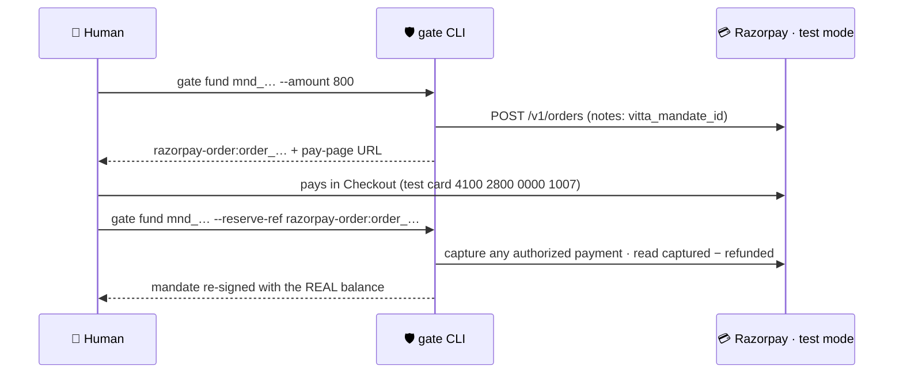

<div align="center">



<br/>

**A human signs a scoped, capped, time-boxed spending permission — a _mandate_.
An AI agent's money-moving actions then either execute or get denied against it.
No LLM sits in the decision path.**

<br/>


</div>

---

## The problem

We are about to hand AI agents a browser and a credit card.

An agent that can search a grocery site can also click **Place Order**. Today, the only thing standing between "find me some peanut butter" and a ₹4,000 charge is the model's own judgment — and a model can be wrong, jailbroken, or simply more enthusiastic than you intended.

**"I'll prompt it not to overspend" is not a spending control.** It's a suggestion written in the same channel an attacker can write to.

## The idea

Move the boundary **outside the model entirely.**

> A human signs *"my agent may spend up to **₹800** at **Blinkit**, in **one** transaction, before **6:00 PM today**."*
>
> The agent then physically cannot exceed that — whether it tries to or not.

The only thing between an agent's write command and it actually happening is a **pure, deterministic function**. It takes no network calls, consults no model, and its rules come from a cryptographically signed human decision — not a prompt.

Same inputs → same verdict. Every time. Forever. Auditable years later.

---

## What Vitta actually is

| | Component | What it does |
|:--:|---|---|
| 📜 | **Mandate** | An Ed25519-signed JSON document. Merchant scope, total cap, per-transaction cap, max transactions, expiry. Renders as plain English you read *before* you sign. |
| ⚖️ | **Policy Engine** | `decide()` — pure, synchronous, zero-I/O, zero-LLM. Returns `ALLOW` / `DENY` / `STEP_UP`. Never throws; unknown input always fails closed to `DENY`. |
| 💳 | **Razorpay (test mode)** | The reserve rail. A human funds the mandate by paying a real Razorpay test Order in Checkout; the reserve is what Razorpay reports as *captured*, and every `ALLOW` draws against it. [Deep dive ↓](#-razorpay-test-mode-integration) |
| 🧾 | **Receipt Chain** | Every `ALLOW` emits a signed, hash-linked receipt. Tamper with one and *every subsequent* link breaks — not just the one you touched. |
| 🖥️ | **Dashboard** | Next.js app: live mandate, live Razorpay balance, decision feed, receipt verification — plus a real storefront with search, cart and one-click gated purchase. |
| 🎯 | **Price Sniper** | Watches a real product's live price in a time window and fires the purchase pipeline the moment it hits your target — through the *same* gate, never around it. |

---

## See it work

<div align="center">

**The storefront** — live multi-merchant search, real carts, mandate-gated checkout


**The docs** — every rule, schema and CLI command documented in-app


</div>

> [!TIP]
> The full-resolution walkthrough lives at `assets/Vitta1.mp4`. It is deliberately **not committed** (69 MB) — attach it to a GitHub Release if you want it hosted.

---

## How a spend happens


Every decision — allow or deny — emits a `GateEvent`, the single contract the CLI, `events.jsonl` and the dashboard all read.

---

## The mandate

What the human signs:

```jsonc
{
  "mandate_id": "mnd_mstyxrlm46b61bf8a4bc",
  "issuer":  "did:key:z6MktLJ3CLa8rezn5W57AbhQnxboegqRFe5kd2dtK8Rnn6cS",
  "subject": "agent:shop-runner",
  "scope": {
    "categories":  ["groceries"],
    "merchants":   ["blinkit", "zepto", "bigbasket"],
    "cap_inr":     2000,   // total, across the mandate's whole life
    "per_txn_inr": 1000,   // ceiling on any single transaction
    "max_txns":    10,
    "expires_at":  "2026-08-15T18:29:00.000Z"
  },
  "reserve": {
    "type":        "razorpay_test_order",
    "blocked_inr": 208,
    "ref":         "razorpay-order:order_Q1w2E3r4T5y6"   // the real Razorpay test order
  },
  "sig": "RXrCU0+QcwbMRSwhTLHyqY+tjlpKz3lSeaG71zIYbbc..."
}
```

Rendered for a human before signing:

> *"agent:shop-runner may spend up to **₹2,000** at Blinkit, Zepto or BigBasket, in one transaction, before **11:59 PM today**."*

---

## 💳 Razorpay test-mode integration

Razorpay is the **reserve rail**. A mandate that hasn't been funded by a real, captured Razorpay test payment cannot authorize a single rupee, and the gate reads the **real captured amount from Razorpay's API** on every write decision rather than trusting anything stored locally.

### How a reserve works

Razorpay is a payments gateway, not a wallet — it has no per-mandate balance and no API to pay a third-party merchant like Blinkit. So Vitta models the reserve honestly:

| Op | What happens | Razorpay call |
|---|---|---|
| `fund` | Create an **Order** stamped with the mandate id; the human pays it in Checkout. Reserve reference = `razorpay-order:<order_id>`. | `POST /v1/orders` |
| `balance` | **Captured payments, net of refunds, minus what Vitta has drawn.** Authorized-but-uncaptured, failed and refunded payments count as ₹0. | `GET /v1/orders/:id`, `/payments` |
| `draw` | A Vitta-side debit, idempotent on the run id. Recorded in an append-only local log **and** in the order's server-side `notes`; the balance uses the *larger* spent figure, so wiping the local file cannot give money back. | `PATCH /v1/orders/:id` |
| `release` | Zero the reserve first, then refund only the unspent amount. | `POST /v1/payments/:id/refund` |
| `credit` | **Rejected.** An order's amount is fixed; a top-up is a new, human-paid order. An agent can never add money. | — |

### The funding flow



In the dashboard the same thing is one button on the Mandate page (Razorpay Checkout opens in a modal), and an optional webhook (`/api/razorpay/webhook`, `order.paid` / `payment.captured` / `payment.authorized`) confirms funding without a click.

### What is defended, and how

- **A reserve is only what Razorpay says was captured.** The Checkout signature and the webhook signature are checked (`HMAC-SHA256`, constant-time), but neither makes money spendable — `gate fund --reserve-ref` re-reads Razorpay itself, so a forged callback finds nothing paid.
- **One order, one mandate.** `--reserve-ref` refuses an order stamped for a different mandate, or one Vitta didn't create, so the same money can't back two mandates.
- **No accidental stranding.** Funding or attaching a different order to a mandate that still holds money is refused unless you pass `--replace`.
- **Test mode only.** `rzp_live_…` keys are refused before any request is made.

Test cards: `4100 2800 0000 1007` (Visa) or `5555 5555 5555 4444` (Mastercard), any future expiry and CVV; on the bank page any 4–10 digit OTP succeeds, fewer than 4 digits fails. See `.env.example` for `RAZORPAY_KEY_ID` / `RAZORPAY_KEY_SECRET` / `RAZORPAY_WEBHOOK_SECRET`.

> **Older mandates.** Mandates funded through Prava carry a reserve reference the Razorpay ledger cannot read. They still verify and load, but fund them again with `gate fund`.

> **Honest limits.** A draw does not move money at Razorpay (nothing could pay the merchant); it debits the funded order. Razorpay's order `notes` are merchant-controlled metadata, not a tamper-proof ledger — they are a second record that makes deleting the local log pointless, not a substitute for one. Re-funding replaces a mandate's reserve rather than adding to it.

## The policy engine

`decide()` evaluates in this exact order — **first match wins**, and the default is never `ALLOW`.

| # | Rule | Verdict |
|:--:|---|---|
| 0 | Read-only command | `ALLOW` — free, short-circuits before any mandate check |
| 1 | Signature doesn't verify | `DENY: BAD_SIGNATURE` |
| 2 | Mandate expired | `DENY: EXPIRED` |
| 3 | Command not in the webcmd manifest | `DENY: UNKNOWN_COMMAND` |
| 4 | Merchant outside mandate scope | `DENY: MERCHANT_NOT_ALLOWED` |
| 5 | Amount not parseable | `DENY: AMOUNT_UNPARSEABLE` |
| 6 | Over the per-transaction cap | `DENY: OVER_PER_TXN_CAP` |
| 7 | Over the remaining total cap | `DENY: OVER_TOTAL_CAP` |
| 8 | Transaction count exhausted | `DENY: TXN_LIMIT_REACHED` |
| ✅ | Everything passed | `ALLOW` |

Around `decide()`, the run pipeline adds one more guarantee: a `runId` that has already drawn cannot draw again (`ALREADY_EXECUTED`) — enforced locally **and** by the ledger, which keys every draw on the run id.

`decide()` is pure. No network. No model. No throw.

---

## Receipt chain

Each receipt carries the SHA-256 of the one before it (`prev_receipt_hash`; the first uses a 64-zero chain head). Verification is two checks:

1. The Ed25519 signature on the receipt validates against the **gate's** public key (not the issuer's).
2. `receipt[i].prev_receipt_hash === sha256(receipt[i-1])`

```
receipt_1 ──sha256──▶ receipt_2 ──sha256──▶ receipt_3
    │                     │                     │
   sig                   sig                   sig      ← each independently verifiable
```

Edit any field in `receipt_2` and you break **two** things at once: its own signature, *and* `receipt_3`'s chain link. Re-signing the tampered receipt doesn't help — the gate's private key isn't yours.

---

## TEST vs LIVE

Both modes run the **identical** pipeline: real search, real merchant cart, real signature and cap checks, real Razorpay reserve read, real ledger draw, real signed receipt. Nothing is stubbed in either.

The single difference is whether the **merchant's** checkout is driven to a placed order.

| | `LIVE` | `TEST` |
|---|---|---|
| Merchant order placed | ✅ real order | ❌ not driven |
| Razorpay reserve | ✅ real (test mode) | ✅ real (test mode) |
| Receipt signed | ✅ with merchant order id | ✅ marked `TEST`, no order id |
| Default | CLI | Dashboard |

`TEST` exists because Blinkit's payment step needs a human with a phone (UPI QR), and COD is intermittently unavailable. It exercises every part this project owns without requiring one.

---

## Tech stack

| Layer | Choice | Why |
|---|---|---|
| Language | TypeScript · Node 20+ | — |
| Policy engine | Hand-written pure function | No framework, no LLM, fully auditable |
| Signing | `node:crypto` Ed25519 | Zero external crypto dependencies |
| Payments | Razorpay REST API via `fetch` (no SDK) | Test mode only — `rzp_live_` keys are refused |
| Browser automation | `@agentrhq/webcmd` | Real stealth-Chromium — **109 sites, 807 commands, 230 write** |
| Dashboard | Next.js 16 · React 19 · Tailwind v4 · shadcn/ui | — |
| Tests | `node:test` | **590 passing**, no external runner |

---

## Multi-agent shopping — Nasiko × Anakin × Vitta

> **Nasiko controls the agents. Anakin gives them the web. Vitta decides whether they may move money.**

One `shop-runner` becomes a small team, each with one job:

```text
 "Find me the cheapest 2kg atta under ₹300 and buy it"
                        │
                        ▼
              ┌───────────────────┐
              │  Nasiko           │  registry · routing · per-hop traces
              └─────────┬─────────┘
   ┌──────────┬─────────┴───┬──────────────┐
   ▼          ▼             ▼              ▼
 Planner → Discovery  →  Evaluator  →  Purchase Agent
 (intent)  (Anakin)      (proposal)         │
                                            ▼
                                     ┌─────────────┐
                                     │ Vitta gate  │  reads the REAL cart · decide() · no LLM
                                     └──────┬──────┘
                                  ALLOW ────┴──── DENY / STEP_UP
                                    │                  └─ browser action never runs, nothing drawn
                                    ▼
                          merchant → Razorpay reserve → signed receipt
```

| Agent | Does | Cannot |
|---|---|---|
| `vitta-shopping-planner` | Parses the request into a structured intent | search or buy |
| `vitta-deal-discovery` | Finds candidates across Blinkit / Zepto / BigBasket via the existing Anakin-first search | place an order (its only access is the read-only search CLI) |
| `vitta-deal-evaluator` | Picks the cheapest *eligible* candidate (size, stock, merchant, ceiling) and explains why | authorize anything — a proposal is not permission |
| `vitta-purchase-agent` | Builds the cart and asks the gate to place the order | bypass the gate; hold payment credentials; top up the reserve |

**The boundary, unchanged.** LLMs and agents decide *what to propose*; the gate deterministically decides *what is permitted*. The gate prices the **real merchant cart** — an agent cannot claim a price — so an over-cap proposal is refused on the cart's true total. `decide()`, the signed mandate, the receipt chain and the reserve ledger are untouched, and `src/agents/security.test.ts` fails the build if an agent ever imports them or spawns a merchant command itself.

**Try it** (no merchant logins or Razorpay keys needed — the merchant and Razorpay are local simulators; the gate, signatures, receipts and agents are real):

```bash
npm install && npm run demo:agents
```

It signs a ₹800 mandate (₹500 per transaction, 2 transactions), buys the cheapest 2kg atta (Zepto ₹229 → ALLOW → receipt, reserve ₹800 → ₹571), then has a *compromised* Evaluator propose a ₹1,299 item — **DENIED `OVER_PER_TXN_CAP`**, zero merchant orders, zero charges — and finally replays the request to show it cannot double-charge. Add `-- --persist-runs` to keep the runs for the dashboard's **Agent activity** page.

**Run it for real**

```bash
npm run build
npm run agents                                   # the four agents as A2A servers (ports 9101-9104)
node dist/cli/shop.js run "cheapest 2kg atta under ₹300" --mode test
```

`--mode` is always explicit (`test` never drives the merchant's checkout; `live` places a real order). Through Nasiko instead of direct calls: set `NASIKO_URL` and the `NASIKO_AGENT_ID_*` variables and every hop is dispatched via Nasiko's orchestrator with one W3C trace id per run — see [nasiko/README.md](nasiko/README.md) for deployment, what is verified and what still needs a live control plane.

**Price Sniper.** With `VITTA_AGENT_PIPELINE=on`, a fired watch runs Discovery (re-reads that product's live price) → Evaluator (re-checks the target) → Purchase Agent → gate. Hitting the target price authorizes nothing by itself.

**Idempotent by request.** A shopping request id buys at most once: a replayed or retried request (Nasiko retries failed steps) returns the recorded result. An interrupted purchase is never silently retried.

## Quickstart

**Prerequisites** — Node 20+, `npm i -g @agentrhq/webcmd`, a Razorpay **test-mode** key pair (Dashboard → API Keys, Test Mode), and a merchant account logged into the webcmd session (`webcmd blinkit whoami`).

```bash
# 1 — install (both workspaces)
npm install
cd dashboard && npm install && cd ..

# 2 — configure
cp .env.example .env                              # RAZORPAY_KEY_ID (rzp_test_…), RAZORPAY_KEY_SECRET
cp dashboard/.env.local.example dashboard/.env.local   # the same test keys (+ optional webhook secret)

# 3 — install the custom merchant adapters
node webcmd-adapters/install.mjs
webcmd scan | grep -E "set-cart-quantity|clear-cart"

# 4 — build the CLI  (the dashboard spawns dist/cli/gate.js — this step is required)
npm run build

# 5 — verify
npm test        # 590 passing

# 6 — run
cd dashboard && npm run dev     # → http://localhost:3000
```

> [!WARNING]
> **`dashboard/.env.local` needs its own copy of the Razorpay test keys.** Next only loads env files from the `dashboard/` directory — the repo-root `.env` is invisible to the Next process. Missing keys surface as *"Razorpay is not configured"* rather than a hard error.

> [!CAUTION]
> `gate` does not auto-load `.env` (no `dotenv` dependency by design). Source it first, or the ledger will stop with "RAZORPAY_KEY_ID and RAZORPAY_KEY_SECRET are not set":
> ```bash
> set -a && source .env && set +a
> ```

---

## CLI reference

```bash
node dist/cli/gate.js <command>
```

| Command | What it does |
|---|---|
| `gate scan` | Show the webcmd manifest — sites, commands, how many are governed |
| `gate mandate create` | Build and Ed25519-sign a new mandate |
| `gate mandate resign` | Re-sign with updated limits (step-up approval) |
| `gate fund <id> --amount <n>` | Create a Razorpay test Order (the reserve); pay it in Checkout. Refuses to replace a reserve that still holds money unless `--replace` |
| `gate fund <id> --reserve-ref razorpay-order:<id>` | Attach a PAID order to the mandate it was created for; captures an `authorized` payment, then reads the real balance from Razorpay |
| `gate fund <id> --auto --amount <n>` | Top up an existing reserve, capped at the signed limit |
| `gate run -- webcmd <site> <cmd>` | Run a command through the gate |
| `gate receipt show <id>` | Display a receipt |
| `gate verify <id>` | Verify a receipt's signature **and** chain link |

```bash
# create → fund → shop, end to end
gate mandate create --subject "agent:shop-runner" \
  --cap 2000 --per-txn 1000 --merchants "blinkit,zepto,bigbasket" --expires "23:59"

gate fund mnd_xxx --amount 800

gate run -- webcmd zepto search "peanut butter"           # read  → ALLOW, free
gate run -- webcmd blinkit set-cart-quantity <id> --quantity 2
gate run -- webcmd blinkit place-order --confirm          # write → gated
```

---

## Repository layout

```
vitta/
├── src/
│   ├── mandate/      # schema · Ed25519 signing · plain-English rendering
│   ├── policy/       # decide() — the rule engine (pure / sync / zero-I/O)
│   ├── ledger/       # RazorpayLedger — real test-mode Razorpay Orders/Payments API (+ signature checks)
│   ├── receipt/      # receipt schema · hash-chain build & verify
│   ├── webcmd/       # manifest loading · safe command execution
│   ├── agent/        # purchase agent — cart sync, gate spawn, state machine
│   ├── events/       # GateEvent — the one schema every consumer reads
│   └── cli/          # `gate` — the only way an action is ever taken
│
├── dashboard/        # Next.js app — shop, mandate, events, receipts, sniper, docs
├── webcmd-adapters/  # custom Blinkit adapters (absolute qty, clear-cart, place-order)
├── assets/           # README media
│
├── mandates/         # runtime · signed mandates
├── receipts/         # runtime · signed receipts
├── events.jsonl      # runtime · append-only decision log
└── keys/             # runtime · Ed25519 keypairs (gitignored)
```

---

## Safety

- **Test mode only.** Every Razorpay call targets test mode — the ledger refuses any key that is not `rzp_test_…`. No live-mode code path exists in this repository.
- **Fail closed.** Unknown command, unparseable amount, expired mandate, bad signature, unreachable ledger — all produce `DENY`. If the balance read fails, the gate treats it as ₹0 and says so out loud rather than guessing.
- **No LLM in the decision path.** `decide()` is deterministic and re-runnable: an auditor can replay the exact inputs years later and get the exact same verdict.
- **Human-in-the-loop for real money.** Funding requires a human completing a real checkout. An agent never enters payment details.
- **Idempotent draws.** The same `runId` cannot draw twice — enforced in the application and keyed on the run id in the ledger.
- **Least privilege.** The dashboard only ever receives the read-only key.

---

<div align="center">


</div>
