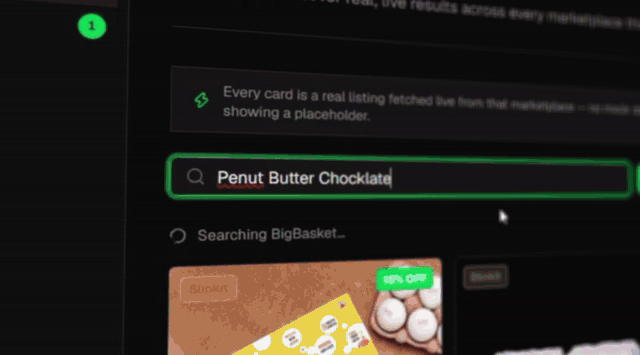
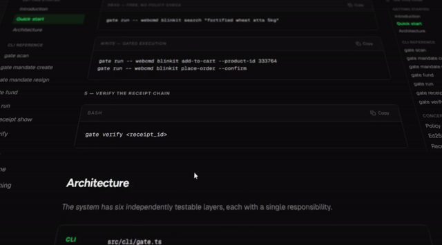
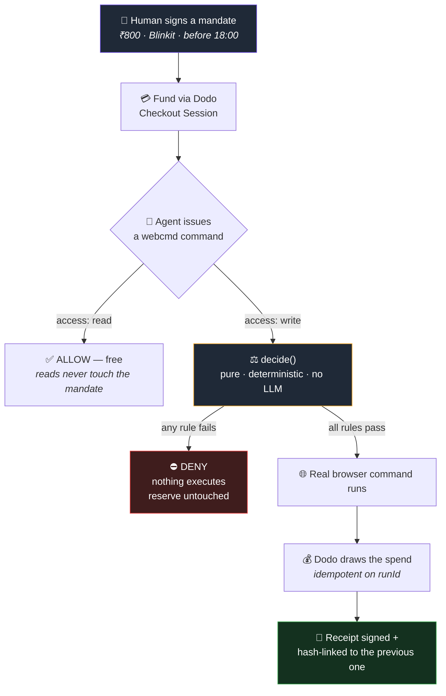
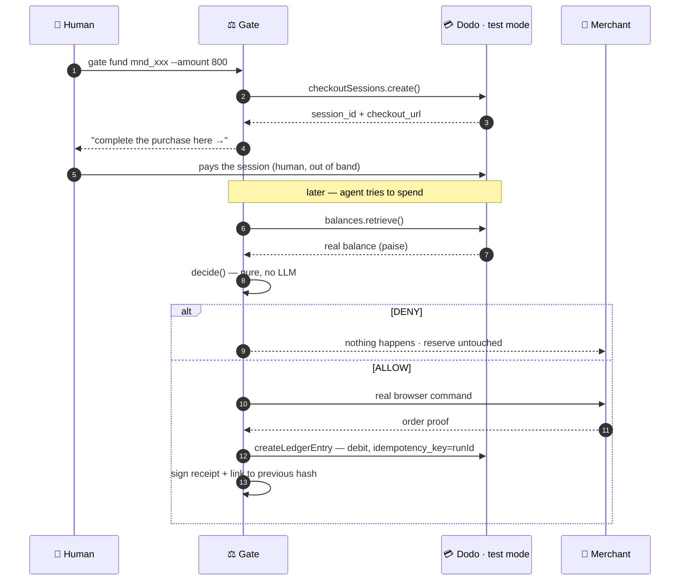

<div align="center">

# Vitta

### Give your AI agent a spending limit it physically cannot break.

**A human signs a scoped, capped, time-boxed spending permission — a _mandate_.
An AI agent's money-moving actions then either execute or get denied against it.
No LLM sits in the decision path.**

<br/>


<br/>



<sub><i>Real listings, real prices, pulled live from Blinkit · Zepto · BigBasket — every card is a real product, not a mock.</i></sub>

</div>

---

## The problem

We are about to hand AI agents a browser and a credit card.

An agent that can search a grocery site can also click **Place Order**. Today, the only thing standing between "find me some peanut butter" and a ₹4,000 charge is the model's own judgment — and a model can be wrong, jailbroken, or simply more enthusiastic than you intended.

**"I'll prompt it not to overspend" is not a spending control.** It's a suggestion written in the same channel an attacker can write to.

## The idea

Move the boundary **outside the model entirely.**

> A human signs *"my agent may spend up to **₹800** at **Blinkit**, in **one** transaction, before **6:00 PM today**."*
>
> The agent then physically cannot exceed that — whether it tries to or not.

The only thing between an agent's write command and it actually happening is a **pure, deterministic function**. It takes no network calls, consults no model, and its rules come from a cryptographically signed human decision — not a prompt.

Same inputs → same verdict. Every time. Forever. Auditable years later.

---

## What Vitta actually is

| | Component | What it does |
|:--:|---|---|
| 📜 | **Mandate** | An Ed25519-signed JSON document. Merchant scope, total cap, per-transaction cap, max transactions, expiry. Renders as plain English you read *before* you sign. |
| ⚖️ | **Policy Engine** | `decide()` — pure, synchronous, zero-I/O, zero-LLM. Returns `ALLOW` / `DENY` / `STEP_UP`. Never throws; unknown input always fails closed to `DENY`. |
| 💳 | **Dodo Payments** | The real money rail. A human funds the mandate through a genuine Dodo Checkout Session; every `ALLOW` draws from a real Credit Entitlement balance. [Deep dive ↓](#-dodo-payments-integration) |
| 🧾 | **Receipt Chain** | Every `ALLOW` emits a signed, hash-linked receipt. Tamper with one and *every subsequent* link breaks — not just the one you touched. |
| 🖥️ | **Dashboard** | Next.js app: live mandate, live Dodo balance, decision feed, receipt verification — plus a real storefront with search, cart and one-click gated purchase. |
| 🎯 | **Price Sniper** | Watches a real product's live price in a time window and fires the purchase pipeline the moment it hits your target — through the *same* gate, never around it. |

---

## See it work

<div align="center">

**The storefront** — live multi-merchant search, real carts, mandate-gated checkout


**The docs** — every rule, schema and CLI command documented in-app



</div>

> [!TIP]
> The full-resolution walkthrough lives at `assets/Vitta1.mp4`. It is deliberately **not committed** (69 MB) — attach it to a GitHub Release if you want it hosted.

---

## How a spend happens



Every decision — allow or deny — emits a `GateEvent`, the single contract the CLI, `events.jsonl` and the dashboard all read.

---

## The mandate

What the human signs:

```jsonc
{
  "mandate_id": "mnd_mstyxrlm46b61bf8a4bc",
  "issuer":  "did:key:z6MktLJ3CLa8rezn5W57AbhQnxboegqRFe5kd2dtK8Rnn6cS",
  "subject": "agent:shop-runner",
  "scope": {
    "categories":  ["groceries"],
    "merchants":   ["blinkit", "zepto", "bigbasket"],
    "cap_inr":     2000,   // total, across the mandate's whole life
    "per_txn_inr": 1000,   // ceiling on any single transaction
    "max_txns":    10,
    "expires_at":  "2026-08-15T18:29:00.000Z"
  },
  "reserve": {
    "type":        "dodo_credit_test",
    "blocked_inr": 208,
    "ref":         "cus_0NkBwH3N9Ld41wgNzK6ty"   // the real Dodo reserve
  },
  "sig": "RXrCU0+QcwbMRSwhTLHyqY+tjlpKz3lSeaG71zIYbbc..."
}
```

Rendered for a human before signing:

> *"agent:shop-runner may spend up to **₹2,000** at Blinkit, Zepto or BigBasket, in one transaction, before **11:59 PM today**."*

---

## 💳 Dodo Payments integration

Dodo is not a logo on a slide here — it is the **settlement rail**. A mandate that isn't funded through Dodo cannot authorize a single rupee, and the gate reads the **real balance from Dodo's API** on every write decision rather than trusting anything stored locally.

### Why Credit Entitlements

A mandate needs a *reserve*: a pot of money that exists, is drawn down atomically, and can be read back as a source of truth. Dodo's **Credit Entitlements** map onto that exactly — so Vitta models the reserve as one entitlement per customer, denominated in **INR paise at 1:1** (`unit: "INR paise"`, `precision: 0`). Credits and paise are the same integer throughout; there is no conversion anywhere to get wrong.

### The four ledger operations

`src/ledger/DodoCreditLedger.ts` implements the `Ledger` interface against the live test-mode API:

| Op | Dodo call | Role |
|---|---|---|
| `fund()` | `checkoutSessions.create()` | Creates a **real** checkout session for the top-up product, overriding `credits_amount` per session. Returns `session_id` + `checkout_url`. A human completes payment — an agent never enters card details. |
| `balance()` | `creditEntitlements.balances.retrieve()` | Reads the live reserve. Called before **every** write decision. |
| `draw()` | `balances.createLedgerEntry({ entry_type: 'debit' })` | Settles an authorized spend. Passes `idempotency_key: runId`, so a replayed run can never double-charge. |
| `credit()` | `balances.createLedgerEntry({ entry_type: 'credit' })` | Auto top-up for a reserve that's short — hard-capped at the mandate's own signed limit, so it can never become a cap bypass. |

### The money path



### Two keys, two jobs

Vitta never lets one credential do both:

- **`DODO_API_KEY`** (write) — `fund()`, `draw()`, `credit()`. CLI only.
- **`DODO_API_KEY_READONLY`** (read) — `balance()` and every dashboard route.

The dashboard **never imports the write key.** This is verified, not assumed: the read-only key returns `401` on both ledger writes and checkout-session creation.

### Notes from integrating against a real account

> [!IMPORTANT]
> These cost real debugging time. They're written down so they don't cost yours.

- **`environment: 'test_mode'` must be passed explicitly.** The SDK defaults to `live_mode`, which rejects test keys with a generic `401` that reads like a bad key rather than a wrong host.
- **`balance` is a JSON `number` on the wire**, even though the SDK's own generated type declares it `string`. Coerce it; never trust the type alone.
- **`checkoutSessions.create()` returns `session_id`**, not `session.id` — and `checkout_url` alongside it.
- **A checkout session resolves to a customer in two hops:** `session.payment_id` → `payments.retrieve()` → `customer.customer_id`. `balance()`/`draw()` are keyed by *customer*, not by session.
- **There is no `.deduct()` method.** Debits are ledger entries, and they *do* accept a real `idempotency_key`.

> [!NOTE]
> **Every Dodo call in this repository targets test mode.** No live-mode code path exists. See [Safety](#safety).

---

## The policy engine

`decide()` evaluates in this exact order — **first match wins**, and the default is never `ALLOW`.

| # | Rule | Verdict |
|:--:|---|---|
| 0 | Read-only command | `ALLOW` — free, short-circuits before any mandate check |
| 1 | Signature doesn't verify | `DENY: BAD_SIGNATURE` |
| 2 | Mandate expired | `DENY: EXPIRED` |
| 3 | Command not in the webcmd manifest | `DENY: UNKNOWN_COMMAND` |
| 4 | Merchant outside mandate scope | `DENY: MERCHANT_NOT_ALLOWED` |
| 5 | Amount not parseable | `DENY: AMOUNT_UNPARSEABLE` |
| 6 | Over the per-transaction cap | `DENY: OVER_PER_TXN_CAP` |
| 7 | Over the remaining total cap | `DENY: OVER_TOTAL_CAP` |
| 8 | Transaction count exhausted | `DENY: TXN_LIMIT_REACHED` |
| ✅ | Everything passed | `ALLOW` |

Around `decide()`, the run pipeline adds one more guarantee: a `runId` that has already drawn cannot draw again (`ALREADY_EXECUTED`) — enforced locally **and** by Dodo's own `idempotency_key`.

`decide()` is pure. No network. No model. No throw.

---

## Receipt chain

Each receipt carries the SHA-256 of the one before it (`prev_receipt_hash`; the first uses a 64-zero chain head). Verification is two checks:

1. The Ed25519 signature on the receipt validates against the **gate's** public key (not the issuer's).
2. `receipt[i].prev_receipt_hash === sha256(receipt[i-1])`

```
receipt_1 ──sha256──▶ receipt_2 ──sha256──▶ receipt_3
    │                     │                     │
   sig                   sig                   sig      ← each independently verifiable
```

Edit any field in `receipt_2` and you break **two** things at once: its own signature, *and* `receipt_3`'s chain link. Re-signing the tampered receipt doesn't help — the gate's private key isn't yours.

---

## TEST vs LIVE

Both modes run the **identical** pipeline: real search, real merchant cart, real signature and cap checks, real Dodo reserve read, real Dodo draw, real signed receipt. Nothing is stubbed in either.

The single difference is whether the **merchant's** checkout is driven to a placed order.

| | `LIVE` | `TEST` |
|---|---|---|
| Merchant order placed | ✅ real order | ❌ not driven |
| Dodo settlement | ✅ real (test mode) | ✅ real (test mode) |
| Receipt signed | ✅ with merchant order id | ✅ marked `TEST`, no order id |
| Default | CLI | Dashboard |

`TEST` exists because Blinkit's payment step needs a human with a phone (UPI QR), and COD is intermittently unavailable. It exercises every part this project owns without requiring one.

---

## Tech stack

| Layer | Choice | Why |
|---|---|---|
| Language | TypeScript · Node 20+ | — |
| Policy engine | Hand-written pure function | No framework, no LLM, fully auditable |
| Signing | `node:crypto` Ed25519 | Zero external crypto dependencies |
| Payments | `dodopayments` SDK ^2.43 | Test mode only |
| Browser automation | `@agentrhq/webcmd` | Real stealth-Chromium — **109 sites, 807 commands, 230 write** |
| Dashboard | Next.js 16 · React 19 · Tailwind v4 · shadcn/ui | — |
| Tests | `node:test` | **238 passing**, no external runner |

---

## Quickstart

**Prerequisites** — Node 20+, `npm i -g @agentrhq/webcmd`, a Dodo Payments **test-mode** account with a Credit Entitlement, and a merchant account logged into the webcmd session (`webcmd blinkit whoami`).

```bash
# 1 — install (both workspaces)
npm install
cd dashboard && npm install && cd ..

# 2 — configure
cp .env.example .env                              # DODO_API_KEY, DODO_API_KEY_READONLY,
                                                  # DODO_CREDIT_ENTITLEMENT_ID, DODO_TOPUP_PRODUCT_ID
cp dashboard/.env.local.example dashboard/.env.local   # read-only key + entitlement id

# 3 — install the custom merchant adapters
node webcmd-adapters/install.mjs
webcmd scan | grep -E "set-cart-quantity|clear-cart"

# 4 — build the CLI  (the dashboard spawns dist/cli/gate.js — this step is required)
npm run build

# 5 — verify
npm test        # 238 passing

# 6 — run
cd dashboard && npm run dev     # → http://localhost:3000
```

> [!WARNING]
> **`dashboard/.env.local` needs its own copy of the Dodo read-only key.** Next only loads env files from the `dashboard/` directory — the repo-root `.env` is invisible to the Next process. Missing keys surface as *"Dodo not yet configured"* rather than a hard error.

> [!CAUTION]
> `gate` does not auto-load `.env` (no `dotenv` dependency by design). Source it first, or you'll get a confusing SDK error about `DODO_PAYMENTS_API_KEY`:
> ```bash
> set -a && source .env && set +a
> ```

---

## CLI reference

```bash
node dist/cli/gate.js <command>
```

| Command | What it does |
|---|---|
| `gate scan` | Show the webcmd manifest — sites, commands, how many are governed |
| `gate mandate create` | Build and Ed25519-sign a new mandate |
| `gate mandate resign` | Re-sign with updated limits (step-up approval) |
| `gate fund <id> --amount <n>` | Create a real Dodo Checkout Session |
| `gate fund <id> --reserve-ref <ref>` | Attach an already-paid reserve; balance read live from Dodo |
| `gate fund <id> --auto --amount <n>` | Top up an existing reserve, capped at the signed limit |
| `gate run -- webcmd <site> <cmd>` | Run a command through the gate |
| `gate receipt show <id>` | Display a receipt |
| `gate verify <id>` | Verify a receipt's signature **and** chain link |

```bash
# create → fund → shop, end to end
gate mandate create --subject "agent:shop-runner" \
  --cap 2000 --per-txn 1000 --merchants "blinkit,zepto,bigbasket" --expires "23:59"

gate fund mnd_xxx --amount 800

gate run -- webcmd zepto search "peanut butter"           # read  → ALLOW, free
gate run -- webcmd blinkit set-cart-quantity <id> --quantity 2
gate run -- webcmd blinkit place-order --confirm          # write → gated
```

---

## Repository layout

```
vitta/
├── src/
│   ├── mandate/      # schema · Ed25519 signing · plain-English rendering
│   ├── policy/       # decide() — the rule engine (pure / sync / zero-I/O)
│   ├── ledger/       # DodoCreditLedger — real test-mode Dodo API
│   ├── receipt/      # receipt schema · hash-chain build & verify
│   ├── webcmd/       # manifest loading · safe command execution
│   ├── agent/        # purchase agent — cart sync, gate spawn, state machine
│   ├── events/       # GateEvent — the one schema every consumer reads
│   └── cli/          # `gate` — the only way an action is ever taken
│
├── dashboard/        # Next.js app — shop, mandate, events, receipts, sniper, docs
├── webcmd-adapters/  # custom Blinkit adapters (absolute qty, clear-cart, place-order)
├── assets/           # README media
│
├── mandates/         # runtime · signed mandates
├── receipts/         # runtime · signed receipts
├── events.jsonl      # runtime · append-only decision log
└── keys/             # runtime · Ed25519 keypairs (gitignored)
```

---

## Safety

- **Test mode only.** Every Dodo call targets test mode. No live-mode code path exists in this repository.
- **Fail closed.** Unknown command, unparseable amount, expired mandate, bad signature, unreachable ledger — all produce `DENY`. If the balance read fails, the gate treats it as ₹0 and says so out loud rather than guessing.
- **No LLM in the decision path.** `decide()` is deterministic and re-runnable: an auditor can replay the exact inputs years later and get the exact same verdict.
- **Human-in-the-loop for real money.** Funding requires a human completing a real checkout. An agent never enters payment details.
- **Idempotent draws.** The same `runId` cannot draw twice — enforced in the application *and* by Dodo's `idempotency_key`.
- **Least privilege.** The dashboard only ever receives the read-only key.

---

<div align="center">

**Vitta** — because a spending limit should be a boundary, not a suggestion.

<sub>ISC Licensed</sub>

</div>
